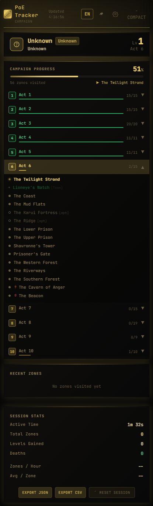
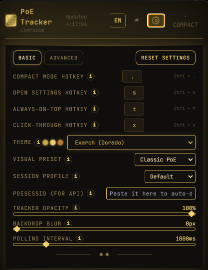
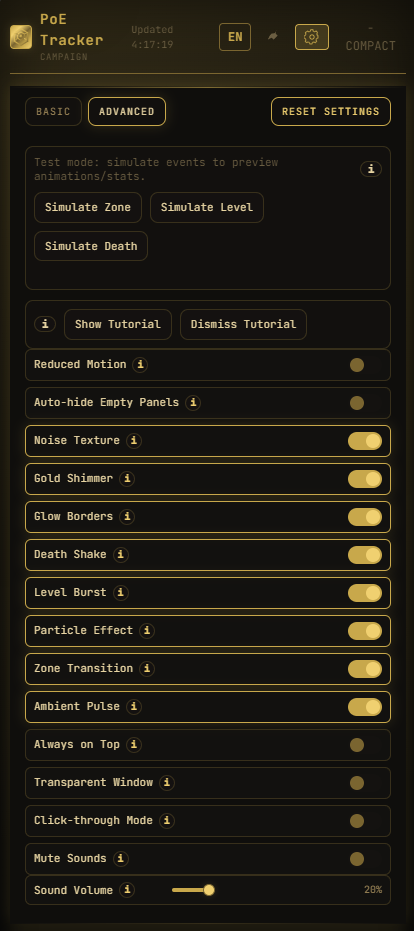
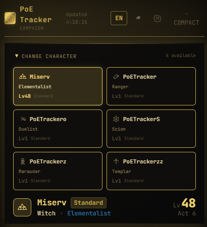

# PoE Tracker (PoE 1 Campaign Overlay)

Aplicación de escritorio para Path of Exile 1 enfocada en seguimiento de campaña en tiempo real, detección de personaje, estadísticas de sesión y personalización visual avanzada.


---

## 🇪🇸 Guía en Español

### 1) ¿Qué es PoE Tracker?

PoE Tracker es un overlay para Windows (Electron) que analiza `Client.txt` de Path of Exile y muestra:

- Personaje activo, clase, ascendencia, nivel y liga
- Progreso de campaña (acts / zonas)
- Zonas recientes y tiempos
- Estadísticas de sesión (zonas/hora, deaths, levels)
- Selector de personajes desde API oficial de PoE (con POESESSID)
- Efectos visuales/sonoros configurables

### 2) Distribución recomendada (.exe)

Si vas a distribuir solo el instalador:

- Archivo principal: `PoE Tracker-Setup-<version>.exe`
- El usuario final **no necesita Node.js ni consola**
- El flujo recomendado es instalar, abrir, configurar POESESSID y jugar

### 3) Instalación y primer uso (paso a paso)

1. Ejecuta el instalador `.exe`
2. Abre PoE Tracker
3. Abre **Settings** (botón engranaje)
4. Pega tu `POESESSID` en `POESESSID (para API)`
5. Espera 1–3 segundos (se refresca automáticamente)
6. Verifica que aparezcan tus personajes en el selector
7. Entra al juego y cambia de zona para inicializar tracking si hace falta

> Nota: ya no debería requerir cerrar/reabrir para detectar personajes.

### 4) Cómo obtener POESESSID

1. Inicia sesión en https://www.pathofexile.com
2. Abre DevTools del navegador (F12)
3. Ve a `Application/Storage > Cookies > pathofexile.com`
4. Copia el valor de `POESESSID`
5. Pégalo en Settings dentro del tracker

### 5) Funciones principales

#### Seguimiento del juego
- Lectura en tiempo real del log `Client.txt`
- Detección automática de eventos:
  - `You have entered <Zone>.`
  - `<Char> (<Class>) is now level <N>.`
  - `<Char> has been slain.`
- Estado por personaje y cambio automático de personaje activo

#### Selector de personajes (API)
- Tarjetas visuales de personaje
- Clase/ascendencia/nivel/liga
- `Ver todos / Ver menos`
- Sección colapsable para ahorrar espacio

#### Personalización UI/UX
- Temas y presets visuales
- Movimiento reducido (accesibilidad)
- Always on top / Click-through / Ventana transparente
- Efectos de nivel, partículas, death feedback
- Sonidos con mute y volumen configurable

### 6) Tips para que funcione perfecto

- Usa siempre un POESESSID válido y activo
- Si la API de PoE rate-limita, espera unos segundos y reintenta
- Asegura que el juego esté escribiendo en `Client.txt`
- Tras pegar POESESSID, espera 1–3 segundos para refresco del selector
- Si cambias de cuenta PoE, reemplaza POESESSID en Settings

### 7) Solución de problemas (Troubleshooting)

#### No aparecen personajes
Checklist:
- ¿POESESSID está pegado correctamente?
- ¿La sesión de PoE web sigue activa?
- ¿Se cargó el selector tras 1–3 segundos?
- ¿Hay errores de red / rate-limit de PoE?

#### No detecta zonas o progreso
- Verifica que PoE esté generando `Client.txt`
- Entra/sal de una zona para generar eventos nuevos

#### Sonidos no se escuchan
- Revisar `Silenciar Sonidos`
- Revisar `Volumen de Sonidos`
- Confirmar que el sistema Windows no tenga la app muteada

### 8) Sección visual (capturas)

Puedes añadir material visual en `docs/media/` y referenciarlo aquí.

Ejemplos:

**Vista general**



**Paneles y selector**

| Settings (Basic) | Settings (Advanced) |
| --- | --- |
|  |  |

| Character Selector |
| --- |
|  |

Bloques sugeridos:
- Dashboard principal
- Panel Settings (Básico y Avanzado)
- Selector de personajes colapsado/expandido

### 9) Seguridad y buenas prácticas

- No compartas tu POESESSID públicamente
- No lo subas a repositorios ni capturas donde se vea
- El token es sensible: trátalo como una contraseña

---

## 🇬🇧 English Guide

### 1) What is PoE Tracker?

PoE Tracker is a Windows desktop overlay for Path of Exile 1. It parses `Client.txt` in real time and displays:

- Active character, class, ascendancy, level, league
- Campaign progression
- Recent zones and timings
- Session statistics
- Character cards from official PoE API (via POESESSID)
- Configurable VFX/SFX and advanced UI settings

### 2) Recommended distribution (.exe)

If you distribute only the installer:

- Main file: `PoE Tracker-Setup-<version>.exe`
- End users **do not need Node.js**
- Install → open app → paste POESESSID → play

### 3) First-time setup

1. Run the `.exe` installer
2. Open PoE Tracker
3. Open **Settings**
4. Paste your `POESESSID` in `POESESSID (for API)`
5. Wait 1–3 seconds (auto refresh)
6. Confirm characters appear in the selector
7. Enter a game zone to initialize log-based tracking if needed

### 4) How to get POESESSID

1. Log in at https://www.pathofexile.com
2. Open browser DevTools (F12)
3. Go to `Application/Storage > Cookies > pathofexile.com`
4. Copy `POESESSID` value
5. Paste it into app Settings

### 5) Key features

- Real-time log watcher (`Client.txt`)
- Auto event parsing (zone, level up, death, login)
- Multi-character session state
- Character card selector with show more/less and collapse
- Theme/preset system
- Advanced overlay controls (always on top / click-through / transparency)
- Audio controls (mute + volume)

### 6) Pro tips

- Keep POESESSID valid (active website session)
- If PoE API rate-limits, wait and retry
- After setting POESESSID, allow 1–3 seconds for refresh
- When switching PoE account, update POESESSID in Settings

### 7) Troubleshooting

#### Characters not loading
- Check POESESSID validity
- Check API/network availability
- Wait a few seconds for refresh/retry

#### Campaign tracking not moving
- Ensure PoE is writing to `Client.txt`
- Enter a new zone to generate fresh events

#### No sound effects
- Check `Mute Sounds`
- Check `Sound Volume`
- Check Windows app-level sound mixer

### 8) Visual media section

Add your screenshots to `docs/media/` and link them here.

**Overview**


**Settings and character selector**

| Settings (Basic) | Advanced Settings |
| --- | --- |
|  |  |

| Character Cards |
| --- |
|  |

---

## Tech Stack

- Electron + Next.js 14 + React 18 + TypeScript
- GSAP + Framer Motion
- SCSS + Tailwind directives
- Zod schemas for event/state validation

---

## Developer Notes (optional)

```bash
npm install
npm run electron:dev
npm run electron:build
```

Build output:
- `dist/PoE Tracker-Setup-<version>.exe`

---

© Geuse — PoE Tracker
